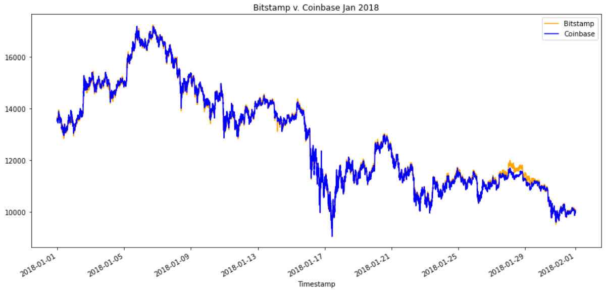
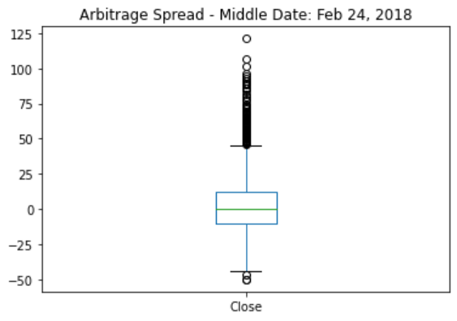

# *Crypto Arbitrage Analysis*

This is a Python-based analysis of arbitrage opportunities in Bitcoin trading between the Bitstampa and Coinbase exchanges.  There were 3 phases to the analysis:  collecting the data, preparing the data, and analyzing the data.  The first half of the analysis compares arbitrage spreads during January 2018 v. March 2018.  The second half focuses on three specific different dates, one in the January, one in February, and one in March.  At the end of the analysis is a summary report with the major conclusions.

---

## Technologies

The application is written in Python 3.8 in a Jupyter notebook with support from the following packages:  

*[Pandas] (https://github.com/pandas) - Data analysis

*[Pathlib] (https://github.com/nemec/pathlib) - Import files

*[Matplotlib] (https://github.com/matplotlib) - Plotting tools

## Installation Guide

No special installs required.

## Usage and Content

To see the analysis, pls clone the repository and open **crypto_arbitrage.ipynb** in JupyterLab.

Here are a few images from the analysis to provide a sample of what can be found:

## Contributors
Vishnu Kurella, vishnu.kurella@gmail.com

## License
VK.LQA 2021
